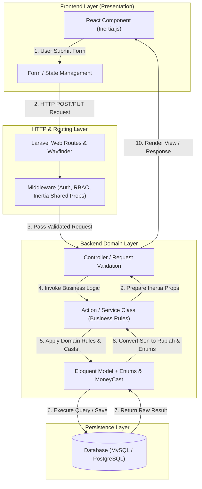

# Architecture & Design Specification - Keuangan Web

Dokumen ini mencatat rancangan arsitektur sistem, *Architecture Decision Records* (ADR), konteks keputusan teknis, serta diagram alur data (*Data Flow Diagram*) untuk proyek **Keuangan Web**.

---

## 1. System Overview

Sistem ini dirancang menggunakan kombinasi **Clean Architecture** dan pendekatan **Domain-Driven Design (DDD) ringan** di atas *framework* Laravel 13 dan Inertia.js v3 dengan React 19.

Tujuan utama dari pilihan arsitektur ini adalah:
- **Integritas Data Tinggi**: Memastikan perhitungan uang dan transaksi finansial 100% presisi tanpa kesalahan pembulatan desimal.
- **Pemisahan Tanggung Jawab (Separation of Concerns)**: Memisahkan *UI/Presentation Layer*, *Domain/Business Logic Layer*, dan *Data Access Layer*.
- **Kemudahan Pemeliharaan (Maintainability)**: Memudahkan penambahan fitur baru seperti multi-rekening atau laporan analitik tanpa merusak logika domain yang ada.

---

## 2. Key Architecture Decisions (ADR)

### ADR-001: Money Representation (Sen & `BIGINT`)
* **Status:** Accepted
* **Konteks:** Penyimpanan nilai mata uang sering mengalami masalah *floating-point arithmetic precision* (contoh: `0.1 + 0.2 = 0.30000000000000004`) jika disimpan dalam tipe data `FLOAT` atau `DECIMAL`.
* **Keputusan:** Seluruh nilai uang disimpan dalam satuan terkecil (sen / dikali 100) menggunakan tipe data **`BIGINT`** (64-bit signed integer).
* **Konsekuensi & Trade-off:**
  * **(+)** Bebas dari bug presisi desimal matematika.
  * **(+)** Aman dari masalah *integer overflow* hingga nominal Rp 92 Kuadriliun.
  * **(+)** Perhitungan dan agregasi matematika di database/CPU jauh lebih cepat dibanding operasi desimal.
  * **(-)** Layer aplikasi (Laravel) wajib melakukan konversi via *Custom Casts* (`MoneyCast`) saat mengirim atau menampilkan data ke UI.

---

### ADR-002: Type-Safe Cashflow Types (`VARCHAR` DB + PHP Enums)
* **Status:** Accepted
* **Konteks:** Menentukan jenis transaksi (`inflow`/`outflow`) membutuhkan kejelasan domain, performa, dan kemudahan pengembangan fitur di masa depan.
* **Keputusan:**
  * **Database Layer**: Menggunakan **`VARCHAR(20) NOT NULL`**.
  * **Application Layer**: Menggunakan **`PHP 8 Backed Enum`** (`CashflowType`).
* **Mengapa tidak menggunakan `BOOLEAN` (1/0)?**
  * Boolean bersifat ambigu (*magic value*) dan kaku jika di masa depan ada penambahan tipe transaksi baru (misalnya `transfer` antar-rekening atau `adjustment`).
* **Mengapa tidak menggunakan `ENUM` native MySQL?**
  * Tipe data `ENUM` pada SQL kaku saat proses pengubahan skema (*ALTER TABLE*) dan dapat memicu *table lock* pada database produksi. Kombinasi `VARCHAR` + `PHP Enum` memberikan fleksibilitas penuh di level kode aplikasi.

---

### ADR-003: Soft Deletes & Audit Trail
* **Status:** Accepted
* **Konteks:** Data keuangan sangat sensitif terhadap penghapusan yang tidak disengaja dan membutuhkan jejak rekam modifikasi data.
* **Keputusan:**
  * Menerapkan **`deleted_at timestamp`** (*Laravel SoftDeletes*) pada tabel utama (`cashflows`, `categories`, dan `users`).
  * Menambahkan kolom audit trail `created_by` dan `updated_by` yang berelasi ke `users.id`.
* **Konsekuensi:**
  * **(+)** Data yang dihapus dapat dipulihkan (*disaster recovery*).
  * **(+)** Akuntabilitas sistem terjaga karena setiap pembuat dan pengubah data tercatat secara otomatis.

---

### ADR-004: Role-Based Access Control (RBAC)
* **Status:** Accepted
* **Konteks:** Pembatasan hak akses menu dan aksi API berdasarkan peran pengguna.
* **Keputusan:** Menerapkan pengelompokan peran via `roles` (`role_id` pada `users`) serta penetapan hak akses langsung (*direct permission assignment*) menggunakan tabel pivot `users` $\rightarrow$ `permission_user` $\rightarrow$ `permissions`.
* **Alasan:** Struktur ini memberikan kemudahan pengelolaan peran utama (*Role*) sekaligus fleksibilitas penetapan hak akses spesifik (*Permission*) per pengguna.

---

## 3. Data Flow Diagram (Logical)

Diagram berikut menggambarkan alur pemrosesan data secara logis dari interaksi pengguna di frontend hingga penyimpanan di database:

---

## 4. Future Improvements (Roadmap)

* **Multi-Wallet Support**: Implementasi fitur transfer antar-rekening/dompet (`wallets`).
* **Audit Log Viewer**: Penambahan layar khusus Admin untuk memantau aktivitas perubahan data.
* **Multi-Currency Support**: Dukungan mata uang asing dengan penambahan tabel `currencies` dan *exchange rate* harian.