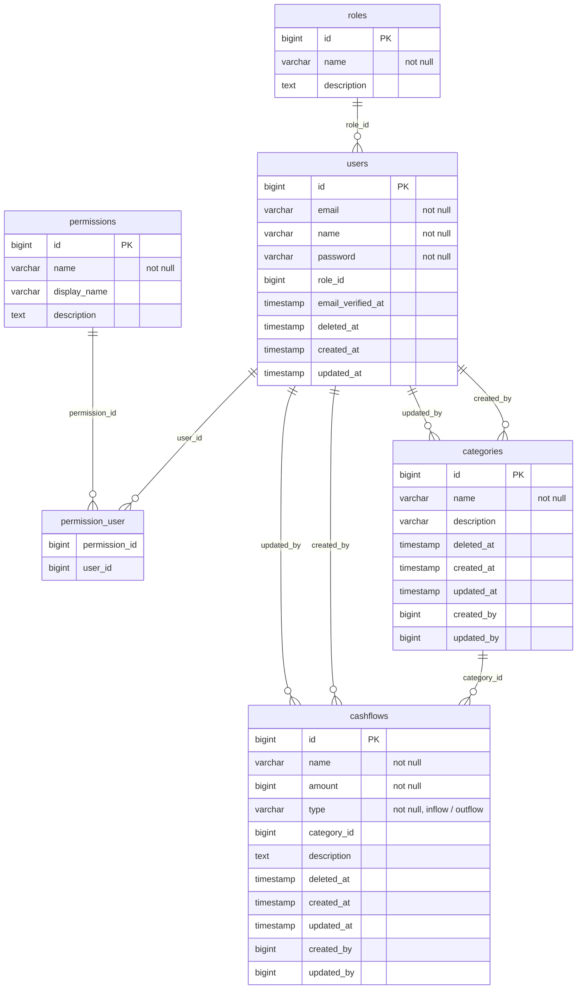

# Database Design & Schema Specification

Dokumen ini berisi spesifikasi rancangan database, relasi antartabel, dan konvensi skema data yang digunakan pada proyek **Keuangan Web**.

---

## 1. Ringkasan Rancangan Database

Rancangan database pada aplikasi ini mengusung beberapa prinsip utama:
- **Akuntansi & Presisi Finansial**: Atribut `amount` pada transaksi arus kas menggunakan tipe data `bigint` (disimpan dalam satuan terkecil/sen) untuk menjamin akurasi perhitungan tanpa masalah *floating-point error* atau *integer overflow*.
- **Role-Based Access Control (RBAC)**: Mengatur hak akses pengguna secara fleksibel melalui entitas `roles`, `permissions`, serta relasi pivot `permission_user`.
- **Jejak Audit (Audit Trail)**: Merekam identitas pengguna yang membuat (`created_by`) dan memperbarui (`updated_by`) data pada tabel utama seperti `categories` dan `cashflows`.
- **Keamanan Data (Soft Delete)**: Menggunakan kolom `deleted_at` untuk mendukung fitur *soft delete*, sehingga data yang dihapus dapat dipulihkan jika diperlukan dan tidak hilang secara permanen dari database.

---

## 2. Skema Database (ERD)

---

## 3. Detail Entitas & Tabel

### A. Pengguna & Akses Kontrol (RBAC)

#### 1. Tabel `users`
Menyimpan informasi pengguna aplikasi.
| Kolom | Tipe Data | Keterangan |
| --- | --- | --- |
| `id` | `bigint` | Primary Key (Auto Increment) |
| `name` | `varchar` | Nama lengkap pengguna |
| `email` | `varchar` | Alamat email unik |
| `password` | `varchar` | Hash kata sandi pengguna |
| `role_id` | `bigint` | Foreign Key mengacu pada `roles.id` |
| `email_verified_at` | `timestamp` | Waktu verifikasi alamat email pengguna (`null` jika belum diverifikasi) |
| `deleted_at` | `timestamp` | Waktu penghapusan (*Soft Delete*) |
| `created_at` | `timestamp` | Waktu pembuatan akun |
| `updated_at` | `timestamp` | Waktu pembaruan akun terakhir |

#### 2. Tabel `roles`
Menyimpan daftar peran pengguna (contoh: Admin, User).
| Kolom | Tipe Data | Keterangan |
| --- | --- | --- |
| `id` | `bigint` | Primary Key |
| `name` | `varchar` | Nama role |
| `description` | `text` | Deskripsi peran/role |

#### 3. Tabel `permissions`
Menyimpan daftar hak akses spesifik di dalam aplikasi.
| Kolom | Tipe Data | Keterangan |
| --- | --- | --- |
| `id` | `bigint` | Primary Key |
| `name` | `varchar` | Kode/nama permission |
| `display_name` | `varchar` | Nama tampilan permission |
| `description` | `text` | Deskripsi rincian permission |

#### 4. Tabel `permission_user`
Tabel pivot relasi *many-to-many* antara pengguna (`users`) dan hak akses (`permissions`).
| Kolom | Tipe Data | Keterangan |
| --- | --- | --- |
| `user_id` | `bigint` | Foreign Key mengacu pada `users.id` |
| `permission_id` | `bigint` | Foreign Key mengacu pada `permissions.id` |

---

### B. Arus Kas & Kategorisasi

#### 5. Tabel `categories`
Menyimpan pengelompokan transaksi (contoh: Gaji, Makanan, Transportasi, Hiburan).
| Kolom | Tipe Data | Keterangan |
| --- | --- | --- |
| `id` | `bigint` | Primary Key |
| `name` | `varchar` | Nama kategori |
| `type` | `varchar` | Tipe kategori (`inflow` / `outflow`) |
| `description` | `varchar` | Penjelasan singkat kategori |
| `created_by` | `bigint` | Foreign Key pengguna pembuat data (`users.id`) |
| `updated_by` | `bigint` | Foreign Key pengguna pembaru data (`users.id`) |
| `deleted_at` | `timestamp` | Waktu penghapusan (*Soft Delete*) |
| `created_at` | `timestamp` | Waktu pembuatan |
| `updated_at` | `timestamp` | Waktu pembaruan terakhir |

#### 6. Tabel `cashflows`
Tabel utama pencatatan transaksi uang masuk (*inflow*) dan uang keluar (*outflow*).
| Kolom | Tipe Data | Keterangan |
| --- | --- | --- |
| `id` | `bigint` | Primary Key |
| `name` | `varchar` | Judul / nama transaksi |
| `amount` | `bigint` | Nominal transaksi dalam satuan sen (integer) |
| `type` | `varchar` | Tipe transaksi (`inflow` / `outflow`) |
| `category_id` | `bigint` | Foreign Key mengacu pada `categories.id` |
| `transaction_date` | `date` | Tanggal terjadinya transaksi |
| `description` | `text` | Catatan atau rincian tambahan transaksi |
| `created_by` | `bigint` | Foreign Key pembuat transaksi (`users.id`) |
| `updated_by` | `bigint` | Foreign Key pembaru transaksi (`users.id`) |
| `deleted_at` | `timestamp` | Waktu penghapusan (*Soft Delete*) |
| `created_at` | `timestamp` | Waktu pembuatan |
| `updated_at` | `timestamp` | Waktu pembaruan terakhir |

---

## 4. Konvensi & Aturan Skema

1. **Format Mata Uang**: Seluruh nilai pada kolom `amount` disimpan dalam satuan integer terkecil (sen). Misal, nominal Rp 50.000,00 disimpan sebagai `5000000`.
2. **Standardisasi Waktu**: Semua atribut `created_at`, `updated_at`, dan `deleted_at` menggunakan format `timestamp` bawaan Laravel.
3. **Auditability**: Setiap operasi penambahan dan pengubahan pada tabel transaksi dan kategori wajib mencatat ID pengguna yang bertanggung jawab melalui kolom `created_by` dan `updated_by`.
